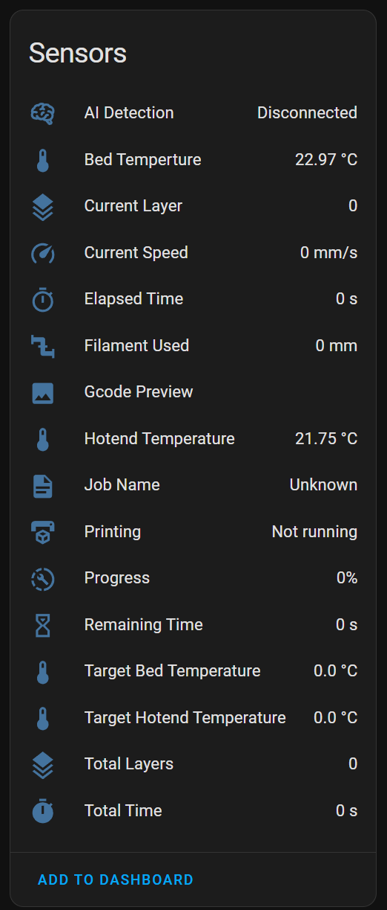

# AnkerMake Home Assistant Component

This component actively listens to the mqtt socket of a
running [ankerctl](https://github.com/Ankermgmt/ankermake-m5-protocol)

## Installation

Install the component by copying the `custom_components/ankermake` folder to your `custom_components` folder.

Alternatively add this repository to your HACS custom repositories and install it from there.

Reboot then go to the integrations page in Home Assistant and add the AnkerMake integration (Under Devices & Services).

## Known issues
There are probably many issues to list...

- There is no image for the integration

## Testing

This component might be unstable! Please report any issues you encounter. I have barely tested it.

## Development

Contributions are very welcome!

The easiest way to add new sensors is by editing
the [sensor_manifest.py](./custom_components/ankermake/sensor_manifest.py)
and [ankermake_mqtt_api.py](./custom_components/ankermake/ankermake_mqtt_api.py) files. The latter file converts the
published mqtt messages to a `AnkerData` object which corresponds to the `key` in the `sensor_manifest.py` file.

The `docker-compose.yml` file can be used to start a local home assistant instance with the component installed.

## Legal

This project is NOT endorsed, affiliated with, or supported by Anker.