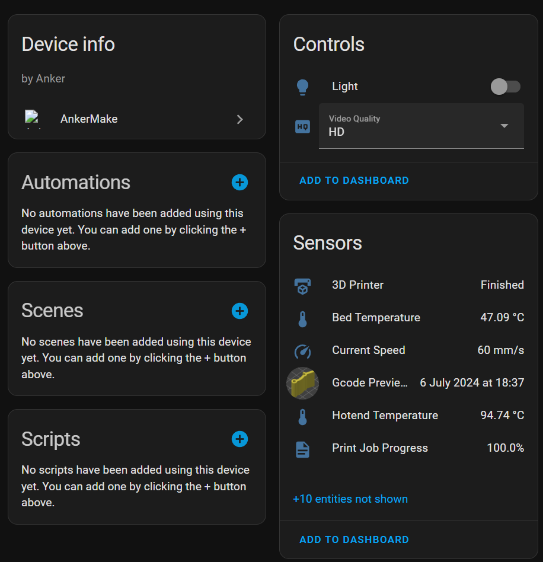
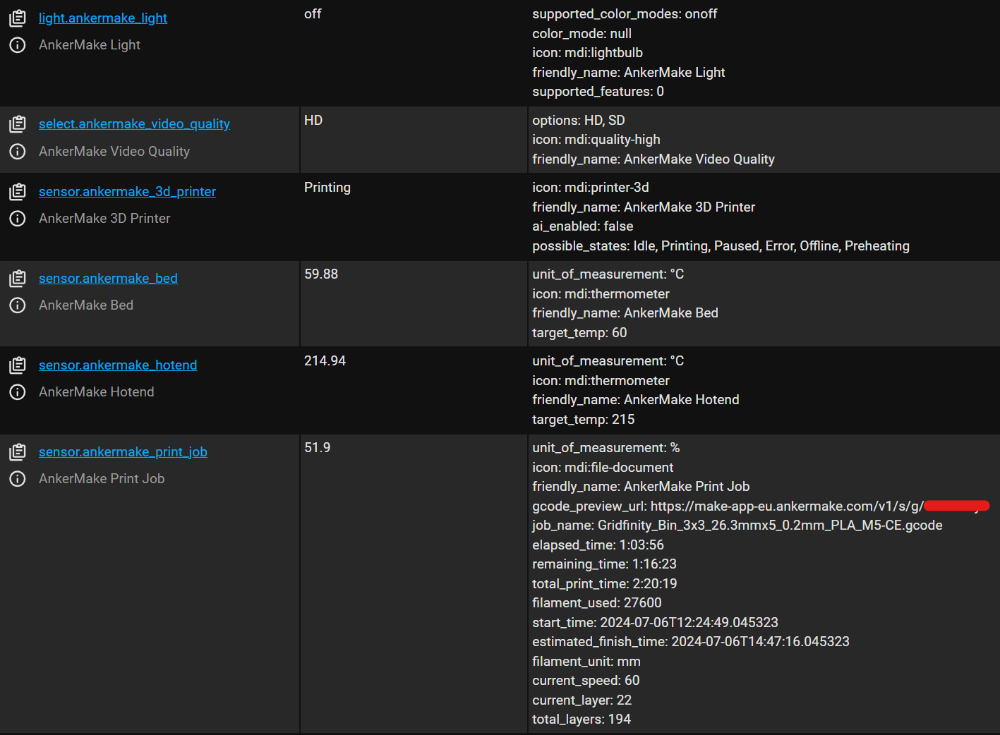

# AnkerMake Home Assistant Component

This component actively listens to the mqtt socket of a
running [ankerctl](https://github.com/Ankermgmt/ankermake-m5-protocol) instance

## Installation

Install the component by copying the `custom_components/ankermake` folder to your `custom_components` folder.

Alternatively add this repository to your custom HACS repositories and install the integration from there.

Reboot & then go to the integrations page in Home Assistant and add the AnkerMake integration (Under Devices &
Services), enter the host of the machine running ankerctl (<ip>:4470) (http(s) links will also work fine). You can add
as many instances as you'd like, but you will need an ankerctl instance running for each.

## Known issues

There are probably many issues to list...

- There is no image for the integration (AnkerMake)
- There's probably an easier way to not poll the mqtt socket (requesting from the printer, right now it just listens on
  a separate thread)
- The integration does not respect the home assistant timezone (but it does for the system timezone)
- No camera support (but can be worked around using go2rtc, though PPPP crashes a lot)

## Testing

This component might be unstable! Please report any issues you encounter. I have barely tested it.

## Development

Contributions are very welcome!

The easiest way to add new sensors is by editing
the [sensor_manifest.py](./custom_components/ankermake/sensor_manifest.py)
and [ankermake_mqtt_adapter.py](./custom_components/ankermake/ankermake_mqtt_adapter.py) files. The latter file converts
the published mqtt messages to a `AnkerData` object which corresponds to the `key` in the `sensor_manifest.py` file.

The `docker-compose.yml` file can be used to start a local home assistant instance with the component installed.

## Legal

This project is NOT endorsed, affiliated with, or supported by Anker.
