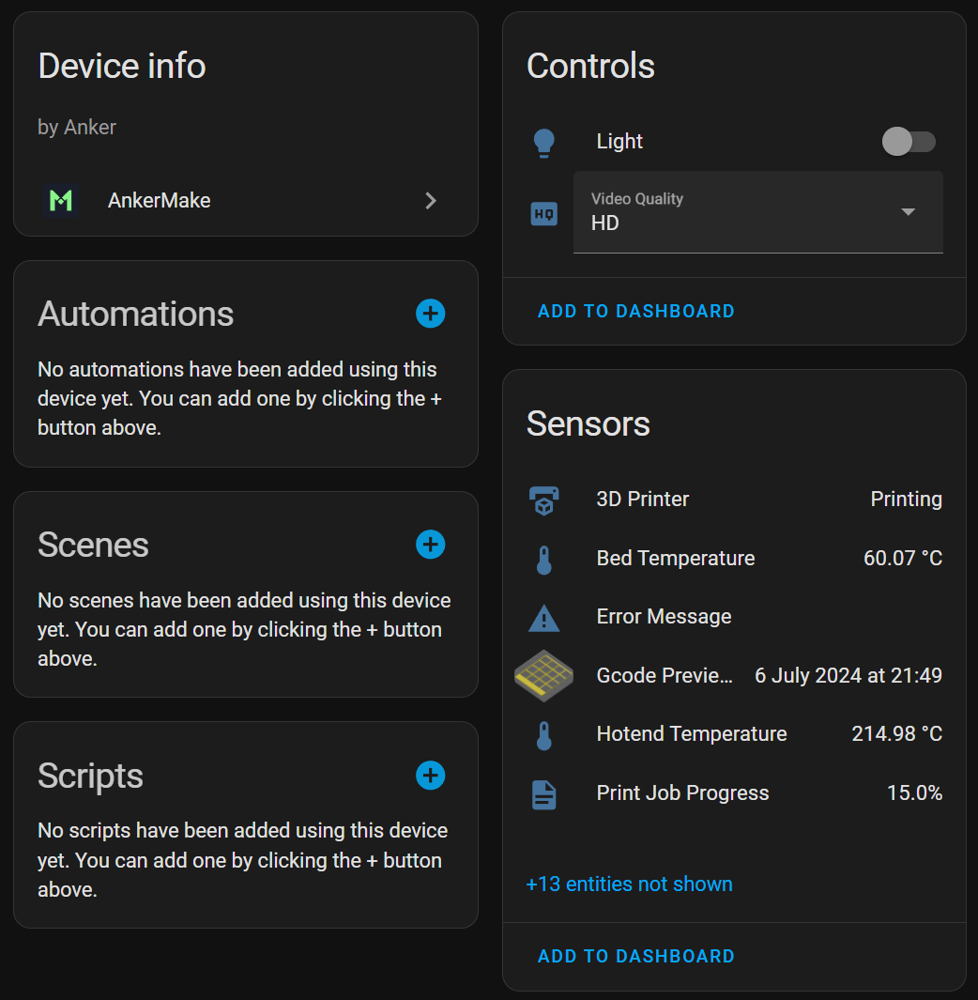

# AnkerMake Home Assistant Component

Ever wanted a quick way to check the status of your AnkerMake M5 3D printer? This Home Assistant component allows you to
do just that! It listens to the mqtt socket of an [ankerctl](https://github.com/Ankermgmt/ankermake-m5-protocol)
instance and updates the status of your printer in real-time.

> Note: There are a lot of hidden entities in the image above, which are mostly set as attributes of the displayed
> entities, such as the current print time, the current layer, the current print progress, the current print time left,
> etc.

`3D Printer state changes to Finished -> Flash some pretty lights -> Hotend temperature is below 40C for 60 minutes -> Disconnect printer from power!`

## Installation

Download and install the component via hacs (alternatively copy the `custom_components/ankermake` folder to your Home
Assistant config) and reboot. You will then be able to add the AnkerMake integration in the Home Assistant integrations
page.

> Note: You can add as many instances as you'd like (but you will need an ankerctl instance running for each one).

## Dependencies

For this component to work, you will need an instance of [ankerctl](https://github.com/Ankermgmt/ankermake-m5-protocol)
running and working. Please refer to the ankerctl documentation for installation instructions. (They do have a Home
Assistant add-on in their organization, but I have not tested it with this component).

## Known issues

There are probably many issues to list...

- Filament will ALWAYS be "Not Implemented" (I have no way of knowing what filament is loaded) - Might add a way to
  manually set this in the future or derive it from the gcode name
- There's probably an easier way to not poll the mqtt socket (requesting from the printer, right now it just listens on
  a separate thread)
- The state will be forgotten if home assistant restarts
- Config flow will not verify the connection to the ankerctl instance (it will just assume it's correct)
- The integration does not respect the home assistant timezone (but it does for the system timezone)
- No camera support (but can be worked around using go2rtc, though PPPP crashes a lot - stable when it doesn't crash!)
- There are no ways to pause/stop a print
- There are no unit tests :(
- Logging is pretty much non-existent, documentation is lacking
- ankerctl can crash sometimes hindering the integration from working until it's restarted

## Testing

This component might be unstable! Please report any issues you encounter. I have barely tested it.

## Development

Contributions are very welcome!

The easiest way to add new sensors is by editing
the [sensor_manifest.py](./custom_components/ankermake/sensor_manifest.py)
and [ankermake_mqtt_adapter.py](./custom_components/ankermake/ankermake_mqtt_adapter.py) files. The latter file converts
the published mqtt messages to a `AnkerData` object which corresponds to the `key` in the `sensor_manifest.py` file.

The `docker-compose.yml` file can be used to start a local home assistant instance with the component installed.

## Legal

This project is NOT endorsed, affiliated with, or supported by Anker.
